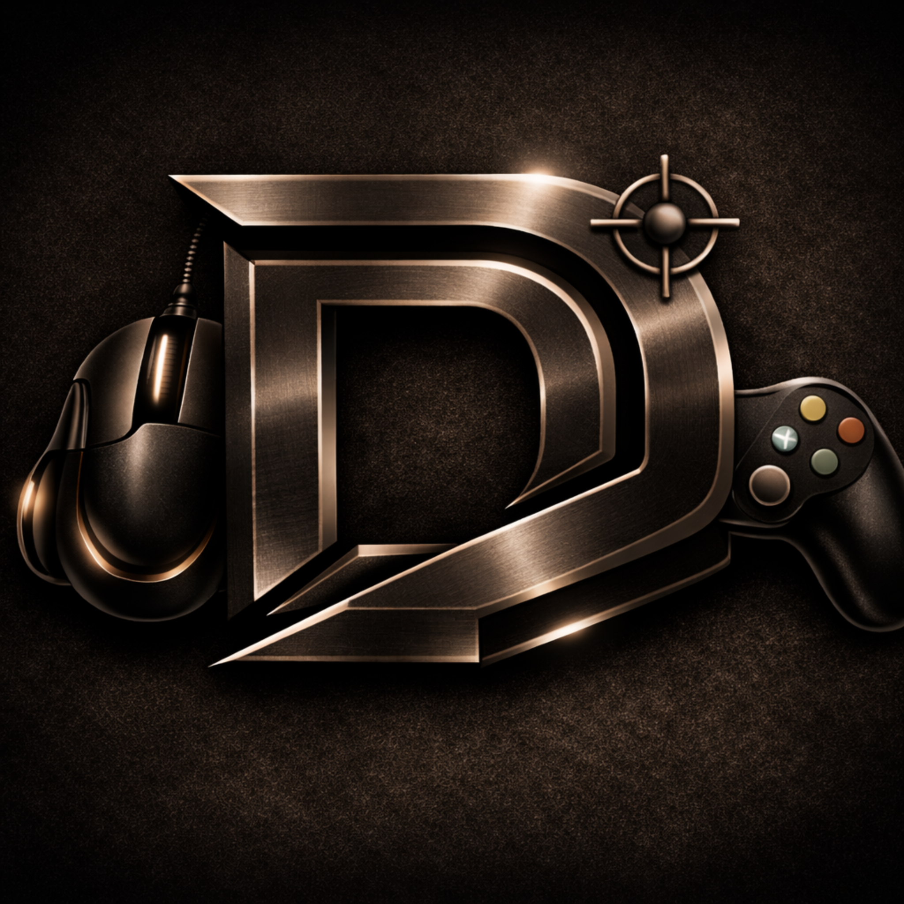

# Mocha Linux

**Conçu pour jouer. Conçu pour aider.**

Une distribution basée sur Arch Linux pour le jeu, la productivité et l’usage quotidien, avec sa propre identité, de hautes performances et des outils graphiques de mise à jour et de récupération.

[Site officiel](https://dieseloslab.org/) · [Versions](https://github.com/dieseloslab/Mocha/releases) · [Problèmes et suggestions](https://github.com/dieseloslab/Mocha/issues)

[Português](README.md) · [English](README.en.md) · [Español](README.es.md) · **Français**

---

## Ce qui distingue Mocha

- **Excellentes performances en jeu :** conçu pour rivaliser avec Windows et d’autres distributions orientées jeu, et capable de les dépasser dans plusieurs jeux et scénarios testés sur la même machine.
- **Noyau Mocha LQX :** basé sur Liquorix et préparé pour une faible latence, une grande réactivité et de bonnes performances.
- **Retour à la dernière configuration valide :** les mises à jour critiques peuvent être annulées lorsqu’un noyau, un pilote ou un composant essentiel provoque une panne.
- **Partition de récupération dédiée :** environnement indépendant pour diagnostiquer, réparer et restaurer le système principal.
- **Interface graphique complète :** mise à jour, maintenance, récupération et sélection des composants sans obliger l’utilisateur à dépendre du terminal.
- **Base prête pour le jeu :** Steam, Proton, GameMode, MangoHud et pilotes sélectionnés par le projet.

## Des performances sans chiffres inventés

Mocha Linux est comparé, sur la même machine, à Windows et à d’autres distributions destinées au jeu. Il a pris l’avantage dans plusieurs scénarios et est resté compétitif dans les autres.

Les résultats chiffrés ne seront publiés qu’avec le matériel, les versions, les réglages et une méthodologie reproductible. Les performances réelles varient selon le jeu, le pilote et l’équipement.

## Mise à jour et récupération

Mocha est conçu pour offrir une voie de retour claire après les mises à jour importantes. Lorsqu’une mise à jour du noyau, d’un pilote ou d’un composant essentiel pose problème, le système peut revenir à la dernière configuration validée.

La partition de récupération complète ce mécanisme avec un environnement graphique indépendant permettant de diagnostiquer, réparer et restaurer l’installation principale.

## Cause sociale T21

Mocha n’est pas seulement un projet technique. Il porte une cause sociale liée à la **trisomie 21**, axée sur la sensibilisation, l’inclusion, la visibilité, l’accueil et le soutien d’initiatives responsables.

Le maintien du projet lui-même — infrastructure, développement, tests, documentation et distribution — est nécessaire pour permettre à Mocha de grandir et d’élargir son impact social de manière durable et transparente.

## Soutenir le projet

Le soutien volontaire contribue aux serveurs, au développement, aux tests, à l’empaquetage, à la documentation et à la maintenance. La cause sociale T21 est présentée avec transparence et développée selon les ressources disponibles et les partenariats responsables du projet.

Consultez le [site officiel](https://dieseloslab.org/) pour connaître les moyens de soutien actuels.

## État du projet

Mocha Linux est en développement actif. Les noyaux, pilotes, interfaces, outils et procédures de récupération continuent d’être testés et documentés avant la publication d’une version stable.

## Contenu du dépôt

Ce dépôt contient la partie publique et reproductible du projet :

- code source et interfaces ;
- scripts et recettes de construction ;
- configurations et politiques ;
- documentation technique ;
- ressources visuelles ;
- tests, rapports publiables et outils de maintenance.

Les caches locaux, secrets, clés privées, images complètes de disques et grands artefacts de compilation restent en dehors de GitHub.

## Crédits

Mocha est construit sur Linux, Arch Linux, KDE Plasma et l’écosystème du logiciel libre, ainsi que sur des projets comme Liquorix, Steam, Proton, Wine, GameMode et MangoHud. Chaque composant externe conserve sa propre licence.

---

[Diesel OS Lab](https://dieseloslab.org/) · [GitHub](https://github.com/dieseloslab/Mocha) · `suporte@dieseloslab.org`

